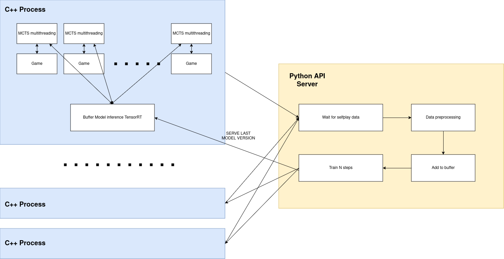

# Connect4 solved with AlphaZero Implementation with C++ and Python with Torch

This project is an implementation of the AlphaZero algorithm, using a combination of C++ for gameplay (self-play) and Python for the server-side operations. The self-play data generated by C++ is sent to a Python-based FastAPI server, where the model is trained. The trained model is then optimized and exported using TensorRT for rapid execution back in the C++ environment. 

The use of C++ is justified because it handles multithreaded execution better than python and game execution. Possibly it can be further optimized as this is my first C++ project. . For this case we solve the Connect4 game, which on my machine with a Ryzen9 7950x CPU and RTX 4090 GPU, solves in about 16 hours.

## System Architecture

- **C++**: Handles the self-play logic, generating gameplay data.
- **FastAPI/Pytorch**: Receives gameplay data, manages training of the neural network, and handles model optimization.
- **TensorRT**: Used for converting the trained model into an optimized format that speeds up inference in the C++ application.



## Prerequisites

Before setting up the project, ensure you have Miniconda installed to manage the Python dependencies. If Miniconda is not installed on your system, you can download it from the [Miniconda website](https://docs.conda.io/en/latest/miniconda.html).

You must also install tensorRT for torch-tensorrt version 1.4.0. In my case, I use CUDA 12.1 and TensorRT (version 8.6.1) installed in ~/Documents/TensorRT-8.6.1.6. 

## Installation

Follow these steps to set up your environment and run the project:

### Setting Up the Python Environment

1. Clone the repository:
   ```bash
   git clone https://github.com/peduajo/AlphaZeroC4.git
   cd AlphaZeroC4
   ```

2. Create the Python environment using the environment.yml file:
   ```bash
   conda env create -f environment.yml
   ```

### Setting Up the C++ Environment

This is the most complicated part if you have no C++ experience. You need to install libtorch 2.0.1. The C++ compiler I am using is version 12.3.0.

## Run

### Python side

Run FastAPI server:

```bash
cd AlphaZeroC4
uvicorn api_train:app --reload
```

Optional tensorboard (in other terminal):

```bash
cd AlphaZeroC4
tensorboard --logdir=runs/
```

### C++ side

Remember that the FastAPI server must be up for this to work.

Execute pipeline for AlphaZero:

```bash
cd C_project
./pipeline.sh --num-par <Number of parallel processes> --num-iter <Number of training iterations>
```

Test:

Test the saved models:

```bash
alphazero_test <mode> <model 1 path> <model 2 path>
```

Where mode has three string options:

1. self_play: 2 models face each other
2. against_god: Play against the user
3. baseline: Play against MCTS without NNs with a lot of simulations (good baseline)

## Custom

You can change hyperparameters for Python and C++ on these files:
- alphazero_train.cpp (dirichlet noise alpha, dirichlet noise epsilon, num searches, num threads mcts (threads for each MCTS play), num threads games (num of paralell games per process) ...). Be careful with batch size because tensorRT models have a range for it.
- api_train.py (ResNet number of blocks, Resnet number of hidden neurons, Exponential decay Gamma for learning rate, weight decay ...)